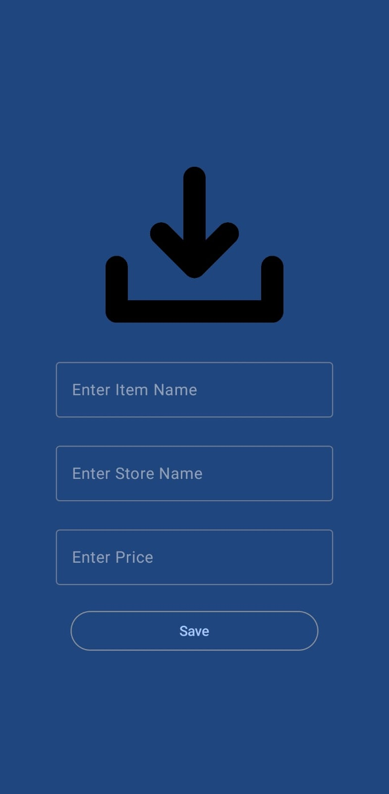

# Shopping Tracker App

A mobile application built with Kotlin that helps users create a wishlist by saving product information including name, photo, store name, and price.

## Features

- Add products to your wishlist with detailed information
- Store product images directly in the app
- View all saved products in a visually appealing list
- Edit or delete saved products
- MVVM architecture for clean separation of concerns
- Fully built with Jetpack Compose UI
- Local data persistence using Room database

## Screenshots

  
   
  

## Tech Stack

- **Kotlin** - Primary programming language
- **Jetpack Compose** - Modern UI toolkit for building native Android UI
- **MVVM Architecture** - (Model-View-ViewModel) for separation of concerns
- **Room Database** - For local data persistence
